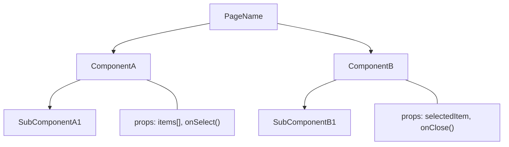
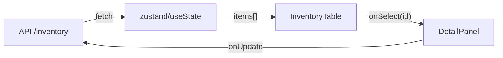

# /build-frontend — 前端并行流水线

> 与 `/build`（后端线）平级，共享 API 契约层
> 架构：Frontend PM → Component Architect → Frontend Dev（内嵌 /fix-frontend）→ Visual QA → Ship
> 设计原则：前端开发用后端的纪律 — 先画图、再写契约、再逐个实现、逐个验证

---

## 与 /build 的关系

```
用户需求
    ├── /build（后端线）
    │   ├── PM → API 契约 → 后端 Dev → pytest QA → Ship
    │   └── 输出：API 接口文档、数据模型、后端测试
    │                    ↓ 共享 API 契约
    └── /build-frontend（前端线）
        ├── Frontend PM → 组件契约 → 前端 Dev → 视觉 QA → Ship
        └── 输出：组件树、状态流图、视觉验收截图、Hermes 经验
```

**共享的**：产品需求、API 接口契约、git 仓库
**各自的**：验收标准、检查方法、Agent 角色

---

## 触发方式

```bash
/build-frontend                          # 交互式，Frontend PM 会问需求
/build-frontend 重构库存页面              # 带描述
/build-frontend --page /inventory        # 指定页面
/build-frontend --component InventoryTable  # 指定组件
```

---

## Step -1: 静默记忆加载（与 /build 一致）

```
ToolSearch("memory-anchor")
get_context()
search_checkpoints(query="{前端关键词}")
search_rules(query="{关键词} BUILD-FRONTEND-SUCCESS BUILD-FRONTEND-FAILURE")
search_experiences(query="前端 {组件/页面关键词}", limit=5)
get_experience_surfaces(target="hermes", topic="frontend-bug-fix")
```

命中 active checkpoint → 确认续跑
命中 BUILD-FRONTEND-FAILURE → 拓扑升级，风险标红
命中 Hermes 前端经验 → 注入到后续 Phase，避免重复踩坑

---

## Step 0: Harness 评分（前端专用维度）

```
┌─ 评估 5 个维度（每项 0-2 分，总分 0-10）─────────────────────┐
│ 1. 涉及几个组件？      0=1-2个  1=3-5个   2=>5个              │
│ 2. 有新交互模式？      0=无    1=改现有交互 2=全新交互模式      │
│ 3. 涉及状态管理？      0=无状态 1=本地state 2=跨组件/全局状态   │
│ 4. 设计稿/需求清晰度？  0=截图够 1=需确认1-2点 2=无设计稿       │
│ 5. 视觉复杂度？        0=纯文字 1=有动画/响应式 2=复杂动画+多端  │
└───────────────────────────────────────────────────────────────┘
```

### 拓扑路由

| 拓扑 | 分数 | 阶段 | 适用 |
|------|------|------|------|
| `MICRO` | 0-2 | Brief → Dev+Verify → Ship | 改文案、改颜色、调间距 |
| `LIGHT` | 3-5 | Brief → Dev+Verify → Visual QA → Ship | 单组件修改、简单交互 |
| `STANDARD` | 6-7 | Frontend PM(1-2问) → Component Architect → Dev+Verify → Visual QA → Ship | 新页面、多组件协作 |
| `FULL` | 8-10 | Frontend PM → Component Architect → Dev+Verify → Visual QA → Ship | 全新功能模块、复杂交互 |

---

## Step 1: Frontend PM（需求拆解）

### MICRO / LIGHT — Team Lead 直接写 Brief

不 spawn PM。直接进入 Dev。

### STANDARD — Team Lead 问 1-2 个关键问题

```
1. 这个页面/组件最终应该长什么样？（有截图最好）
2. 用户在上面会做什么操作？（点击、输入、拖拽、滚动？）
```

### FULL — Spawn Frontend PM Agent

Frontend PM 最多问 3 个问题（逐个问，不甩墙）：

```
1. 用户场景：谁在什么情况下用这个页面？核心操作路径是什么？
2. 视觉参考：有设计稿/截图/参考网站吗？想要什么风格？
3. 交互要求：有动画/过渡/响应式/多端要求吗？
```

输出：**Frontend Requirement Card**

```markdown
# Frontend Requirement Card

- 页面/组件名：
- 用户场景：谁、什么时候、做什么
- 操作路径：Step 1 → Step 2 → Step 3
- 视觉参考：截图/URL/描述
- 交互要求：动画/过渡/响应式/多端
- 依赖的 API：列出后端接口（从 /build 的 API 契约获取）
- 不做的：明确排除项
```

---

## Step 1.5: 读取 DESIGN.md + 生成 Design Brief（每次自动执行）

```
必须执行（不可跳过）：
1. 检查项目根目录是否有 DESIGN.md
2. 有 → 读取全文，作为后续所有 Phase 的视觉约束
3. 没有 → 问用户："项目没有 DESIGN.md，要从现有代码提取生成一个吗？"
   → y → 读 CSS variables / theme 文件 → 按 Google Stitch 格式生成
   → n → 使用 bao-design 默认规范

DESIGN.md 的约束力：
- Component Architect 的组件样式必须引用 DESIGN.md 的 token
- Frontend Dev 写的 CSS 必须用 DESIGN.md 定义的 variable
- Visual QA 的检查清单直接从 DESIGN.md 的 Do's/Don'ts 生成
```

### Design Brief（写代码前必须先输出）

> 来源：从 AI Designer 反向提取的设计决策框架。
> 核心原则：先定义视觉意图，再写代码。不定义就开写 = 出来的东西必丑。

在 STANDARD / FULL 拓扑中，Dev 开始写任何 CSS 之前，必须先输出：

```markdown
## Design Brief

**Aesthetic DNA**: {命名设计风格，例如 "Refined Enterprise" / "Clean SaaS" / "Warm Commerce"}
**UI Paradigm**: {布局范式，例如 "Sidebar + Canvas" / "Top Nav + Content" / "Full-width Cards"}
**Palette Strategy**:
  - Neutral: {中性色系，例如 slate / gray / zinc}
  - Brand: {主色，例如 blue-600}
  - Semantic: {成功=emerald, 警告=amber, 危险=rose}
**Typography**: {字体组合，例如 Inter + Noto Sans SC}
**Icon Library**: {统一图标库，例如 Phosphor / Lucide / Ant Design Icons}
**Shadow Strategy**: {只用 soft shadow / 不用 hard box-shadow}
**Spacing Rhythm**: {基础间距单位，例如 gap-6, p-5, px-6}
```

### 三层布局架构（Layout Hierarchy）

```
Macro Architecture — 页面级骨架
  ├── 侧边栏宽度、主内容区分割
  ├── Header 高度、sticky 行为
  └── 整体 flex/grid 方向

Meso Architecture — 区域级编排
  ├── Bento Grid（指标卡片网格）
  ├── 非对称布局（2/3 vs 1/3 面板）
  └── 数据表格区域

Micro Architecture — 组件内部结构
  ├── 卡片内部：icon + 数据 + 趋势标签
  ├── 列表项：排名 + 缩略图 + 信息 + 进度条
  └── 表格行：状态点 + 数据 + 操作按钮
```

### CSS 质量铁律（Dev 阶段强制执行）

```
✅ DO:
  - Hover 用 translateY(-1px) + shadow 扩展（轻盈感）
  - 状态标签用 bg-{color}-50 + text-{color}-700 + border-{color}-200（三件套）
  - 数字用 tabular-nums（等宽数字，表格对齐）
  - 搜索/输入框用 focus:ring-4 + focus:border-brand-300
  - 圆角统一：卡片 rounded-xl, 按钮 rounded-lg, 标签 rounded-full
  - 间距有韵律：section gap-6, card p-5, 内部元素 space-y-3

❌ DON'T:
  - 禁止 transition: all（性能杀手 + 意外动画）→ 用 transition-colors/transition-shadow
  - 禁止 scale() 在非按钮元素上（表格行 hover 用 scale = 上次爽霸ERP踩的坑）
  - 禁止 ::after/::before 装饰性伪元素（和 Ant Design 冲突）
  - 禁止硬编码颜色值 → 必须用 CSS variable 或 Tailwind token
  - 禁止 position: relative 只为了装饰效果（z-index 污染）
  - 禁止 box-shadow 用 rgba(0,0,0,0.3+) 的重阴影 → 最深不超过 rgba(0,0,0,0.05)
```

---

## Step 2: Component Architect（组件架构）

### 只在 STANDARD / FULL 执行

输出：**Component Architecture Packet**

必须包含以下 4 项：

#### 2a. 组件树（Mermaid 图）



**铁律：画不出组件树 = 需求没想清楚 = 禁止开始写代码**

#### 2b. 数据流图



#### 2c. 组件契约表

| 组件 | Props | Events | State | 文件路径 |
|------|-------|--------|-------|----------|
| InventoryTable | items: Item[], loading: boolean | onSelect(id) | sortBy, filterBy | src/components/InventoryTable.tsx |
| DetailPanel | item: Item \| null | onClose(), onUpdate(data) | editMode | src/components/DetailPanel.tsx |

#### 2d. 实现顺序

```
1. [底层] 纯展示组件（无状态）
2. [中层] 带本地状态的交互组件
3. [顶层] 页面组件（组装 + 全局状态）
4. [最后] 动画 / 过渡 / 响应式适配
```

**原则：先稳后美。先让逻辑跑通，最后加动画。**

---

## Step 3: Frontend Dev + /fix-frontend 修验循环

### 逐组件实现（不是一次性写完整个页面）

按 Step 2d 的实现顺序，**一个组件一个组件地写**：

```
对于每个组件：
  1. 读组件契约（Props/Events/State）
  2. 写组件代码
  3. ── 进入 /fix-frontend 修验循环 ──
     │  Phase 1: 截基线（Glance MCP 截图）
     │  Phase 4: 截修后图 + AI 视觉对比
     │  Phase 5: 通过 → git commit "feat(ComponentName): 实现XX"
     │           失败 → revert → 重写
     │  Phase 6: 存 Hermes 经验
  4. ── 循环结束，进入下一个组件 ──
```

### Dev Report（每个组件完成后输出）

```markdown
## Component Dev Report: {ComponentName}

- 契约符合：✅ props/events/state 全部按契约实现
- 视觉验证：✅ Glance 截图对比无回归
- 文件：src/components/{ComponentName}.tsx
- commit: {hash}
- 已知限制：{如果有}
```

### 整页组装

所有组件写完后，组装到页面：

```
1. 写页面组件（import 所有子组件 + 连接状态）
2. Glance MCP 截整页图
3. AI 检查：组件间布局是否正确、数据流是否通畅、交互是否连贯
4. 通过 → commit
5. 失败 → 定位问题组件 → /fix-frontend 单独修
```

### 反模式门控（Dev 阶段自动检测）

写代码时如果检测到以下模式，**立即停止**：

```
⚠️ 正在同时修改 3+ 个组件文件 → 拆开，一次一个
⚠️ 正在跳过组件契约直接写 → 先回 Step 2 补契约
⚠️ 正在写 500+ 行的巨型组件 → 拆分成子组件
⚠️ 正在复制粘贴另一个组件的代码 → 抽共享组件
⚠️ 正在给组件加 10+ 个 props → 接口设计有问题，回 Step 2
```

### Step 3.5: De-Sloppify 清理（整页组装后执行）

```
核心问题：同一个 AI 实现功能时携带"最短路径"偏差——能跑就行，不管干净。
解决方案：用独立上下文做一轮清理，不共享实现时的思路偏差。

来源：ECC (everything-claude-code) De-Sloppify Pattern

流程：
  1. 功能实现完成 + 整页组装通过后
  2. git commit 当前状态（保护现场）
  3. 开新的审查（spawn Agent 或 /compact 后重新开始），只给它：
     - git diff（本次所有改动）
     - DESIGN.md（设计约束）
     - 组件契约表
  4. 审查并清理：
     - 删除不必要的类型断言（as any, as unknown）
     - 删除过度防御性检查（不可能为 null 的地方检查 null）
     - 删除调试代码（console.log, debugger, TODO）
     - 统一命名风格（camelCase for variables, PascalCase for components）
     - 确保所有颜色/间距/圆角用 CSS variable 而非硬编码
     - 检查 DESIGN.md Anti-Patterns 是否有违反
  5. 清理后跑 lint + type check → 通过 → commit "refactor: de-sloppify {page}"
  6. 清理后截图对比 → 确认视觉无变化
```

---

## Step 4: Visual QA（视觉验收）

### MICRO — 不跑 Visual QA

Dev 的截图证据够了。

### LIGHT — 快速视觉检查

```
1. Glance 截整页图
2. AI 检查：布局正确、文字可读、交互可用
3. 一句话结论：PASS / FAIL + 原因
```

### STANDARD / FULL — 完整视觉验收

```
1. 桌面视口截图（1440px）
2. 平板视口截图（768px）— 如果有响应式要求
3. 手机视口截图（375px）— 如果有响应式要求
4. 交互状态截图：hover、active、disabled、loading、empty、error
5. 动画检查：过渡流畅、不卡顿、不闪烁

检查清单：
☐ 组件间间距一致
☐ 字体/颜色符合设计系统
☐ 点击区域足够大（至少 44px）
☐ loading 状态有反馈
☐ 空状态有提示
☐ 错误状态有处理
☐ 与设计稿/参考图对比（如果有）
```

### Visual QA Report

```markdown
## Visual QA Report

- 页面：{page_path}
- 视口：Desktop ✅ / Tablet ✅ / Mobile ⚠️
- 交互状态：6/6 checked
- 回归检测：无新问题
- 评分：A / B / C / D / F
- 问题列表：
  1. [P2] Mobile 下表格横向溢出 → 建议加 overflow-x: auto
- 截图证据：/tmp/build-frontend/qa/{timestamp}/
- 结论：PASS / CONDITIONAL PASS / FAIL
```

如果 FAIL → 问题回流到 Step 3，用 /fix-frontend 逐个修复，修完重新 QA。

---

## Step 5: Ship（与 /build 一致的门控）

### Pre-Ship Checklist

- `MICRO`
  - [ ] Dev 截图证据存在
  - [ ] 用户看过结果

- `LIGHT`
  - [ ] Visual QA = PASS
  - [ ] 用户看过结果

- `STANDARD / FULL`
  - [ ] Component Architecture Packet 确认
  - [ ] 所有组件 Dev Report = PASS
  - [ ] Visual QA = PASS 或 CONDITIONAL PASS（P2以下问题可带走）
  - [ ] 用户看过结果

### Git

```
commit message 格式：
  feat(frontend/{page}): {一句话描述}
  
  Components: ComponentA, ComponentB, ComponentC
  Visual QA: PASS
  Topology: STANDARD
```

### Hermes 经验存储

```
成功：
  add_rule(
    content="[BUILD-FRONTEND-SUCCESS] 页面: {page} | 拓扑: {topology} | 组件数: N | 
             组件树: {mermaid摘要} | 耗时: {time} | 
             关键决策: {什么设计选择被证明是对的}",
    memory_kind="procedure",
    category="architecture",
    steps=[实现顺序],
    activation_cues=[页面名, 组件名, 类似需求关键词],
    success_signal="Visual QA PASS + 用户确认",
    failure_modes=[开发过程中遇到的坑]
  )

失败：
  add_rule(
    content="[BUILD-FRONTEND-FAILURE] 页面: {page} | 拓扑: {topology} | 
             失败阶段: {PM/Architect/Dev/QA} | 根因: {why}",
    memory_kind="procedure",
    category="bug",
    failure_modes=[什么方案行不通]
  )

周期性：
  build_experience_artifacts(target="hermes", topic="build-frontend")
```

---

## 快捷模式

```bash
/build-frontend quick        # 跳过 PM 和 Architect，直接 Dev+Verify
/build-frontend --from-build  # 从 /build 的 API 契约自动生成组件契约
/build-frontend learn         # 手动触发 Hermes 经验编译
/build-frontend status        # 查看当前进度（如果有 active checkpoint）
```

---

## 与现有 Skill 的协作

| Skill | 关系 |
|-------|------|
| `/build` | 后端并行线，共享 API 契约 |
| `/fix-frontend` | 内嵌在 Step 3 的修验循环 |
| `/code-contract` | Step 2 组件契约的底层工具 |
| `/bao-design` | 提供设计系统 token（颜色/字体/间距） |
| `/qa` | Step 4 Visual QA 的底层能力 |
| `/design-review` | 可在 Step 4 后追加设计评审 |
| `/ship` | Step 5 的 git 和验收流程 |
